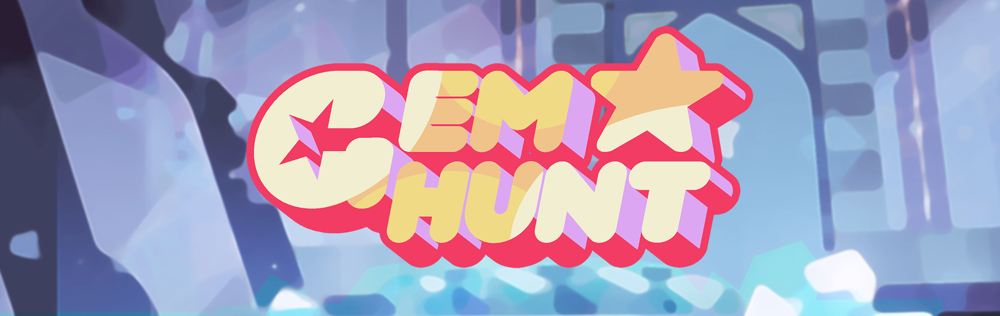

Play as Garnet, Amethyst and Pearl, and Steven, and even more in this strategic 
dice game where you hunt and capture corrupted gems. Up to 5 players, with your 
friends on the same device or play against the mighty Holo-Pearls.

## Installation

Just download the app directly from [Google Play Store](https://play.google.com/store/apps/details?id=com.crystalgems.gemhunt)

You can also directly play on [Itch.io](https://antoinechedin.itch.io/gem-hunt)

If you want to build from source, download the repository and open the project
with [Unity](https://unity.com/)

## Background

The first version of this game was made in Android during my computer science
bachelor's degree. There were no animations and no tutorial making the game very
unclear and barely playable. A few years later, I received an email from a user
who really wanted to understand how to play, and it gave me the motivation to
take over the project. I started over again from scratch, but this time with Unity
since it was a good opportunity to learn how to use the engine.

Now there's a tutorial, new animations and art and the game is translated in
English, French, Spanish, Portugese, Russian and Arabic.

## How to play

Gem Hunt is a dice game where you track corrupted gems to capture them. On your
turn, 3 dice are taken from the pool and rolled. Each represents a corrupted
gem. Green dices are the easiest, orange are medium though and red are the
thoughest.

The dices have 3 symbols:

- Bubble: You caputered the gem, scoring 1 point. There's 3 of them on green
dice, 2 on orange and only 1 on red.
- Claws: The gem fought back! You lose 1 life point. There's 3 of them on red
dice, 2 on orange and 1 on green.
- Footprints: The gem escaped. If you choose to continue your hunt, you will
re-roll this dice instead of picking a new one. There's 2 of them, no matter the
dice color.

If you lose all your life points, your turn is over and you lose all the points
you got this turn. Otherwise, you can choose to stop or to continue the hunt. If
you choose to stop, you save your points, you restore your health and the next
player's turn begins. If you choose to continue, bubble and claws dice are set
aside and new random dice are taken from the pool so you always have 3 dice to
roll.

Keep in mind that re-rolling red dice are more dangerous than green ones. If you
only have 1 life point left, maybe you should stop your hunt. Same thing if
there's only red or orange dice left in the pool. So keep an eye on it

The first player to have 13 points or more wins the game.
